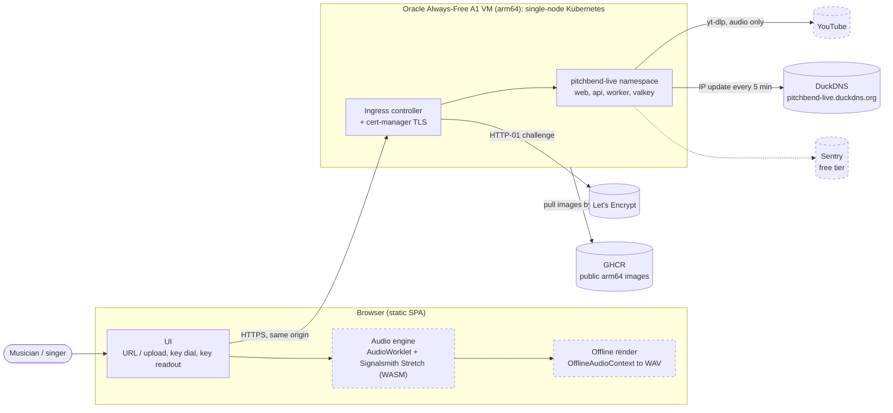
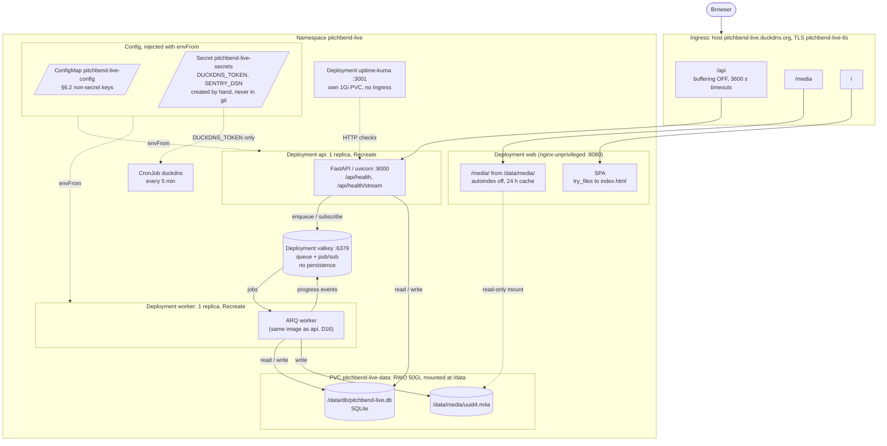
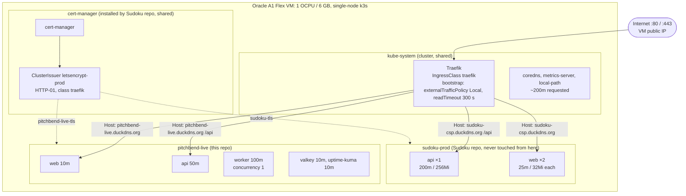
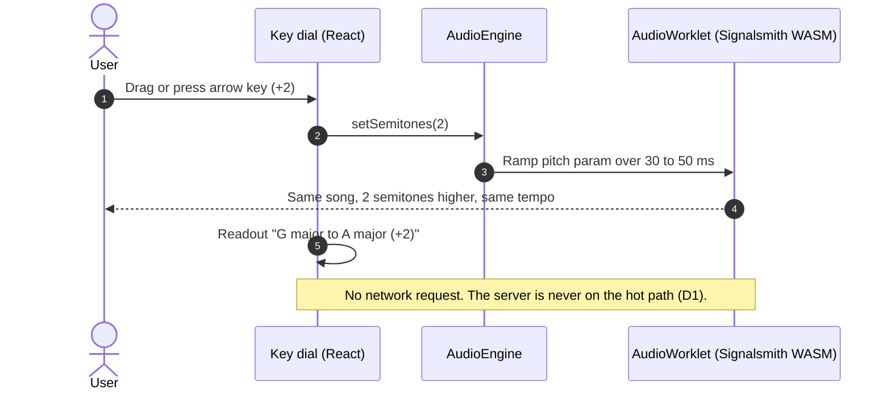
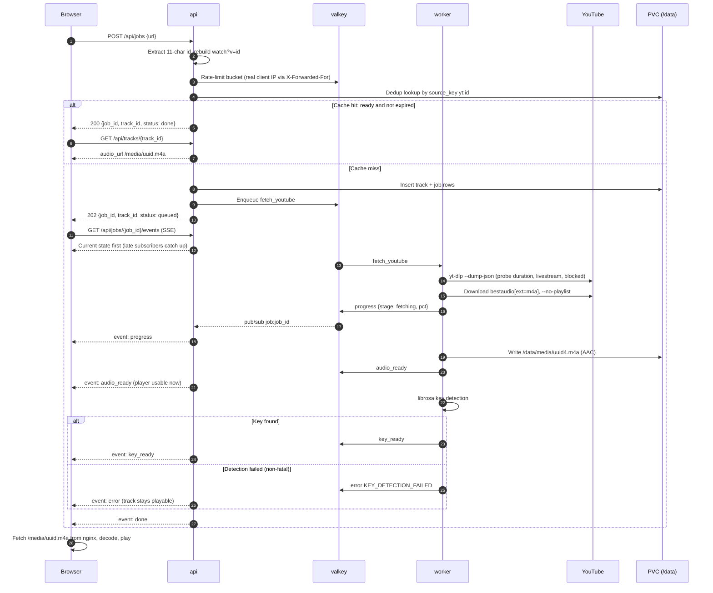
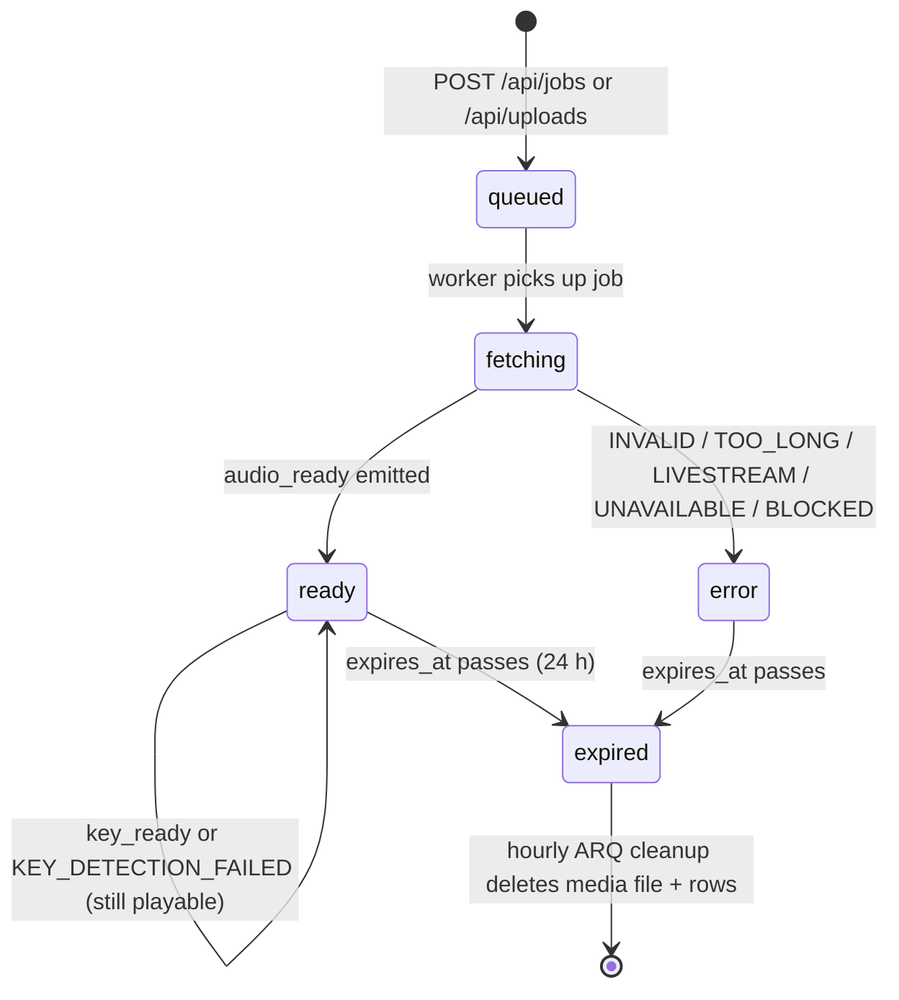
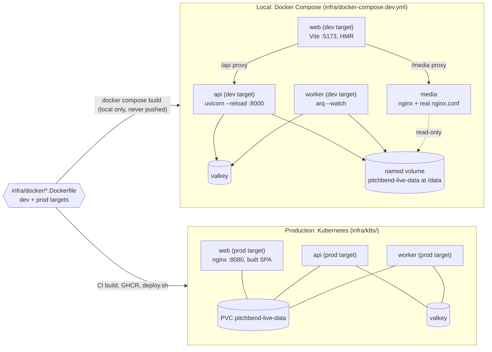
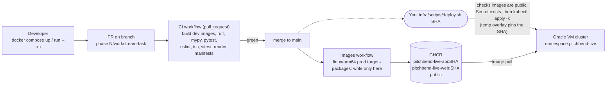

# PitchBend Live architecture diagrams

These diagrams show how PitchBend Live fits together. `ARCHITECTURE.md` is the source of truth: §4 covers the topology, §6 the contracts, and §9–12 the phases. If a diagram and the document disagree, the document wins; fix the diagram.

**Legend:** solid boxes exist after **Phase 0** (infrastructure and skeletons). Dashed boxes arrive in **Phase 1+**.

---

## 1. System context

Who talks to whom. The core principle (§4, D1): the server fetches and analyzes each song **once**. Every dial move is handled **in the browser**.

---

## 2. Runtime topology: `pitchbend-live` namespace

Every workload runs on the one node. The ReadWriteOnce PVC pins them there on purpose (D7). `api` and `worker` are the only SQLite writers, so each runs as **exactly 1 replica with `strategy: Recreate`**.

---

## 2b. Shared cluster: PitchBend Live and the Sudoku Solver

The 1 OCPU / 6 GB VM also runs the Sudoku Solver. Traefik routes by hostname, and cert-manager and the ClusterIssuer (installed by the Sudoku repo) serve both apps. PitchBend Live owns only its namespace (§3.7, ADR 0003). The requests below add up to ~630m of the node's 1000m CPU, and at least 250m must stay free for Sudoku's rolling updates.

---

## 3. A dial move never touches the server

This is the North-star UX path: under 100 ms, with no playback restart. Pitch changes; tempo stays at 1.0 (§6.8, §10 B3).

---

## 4. Ingest: paste URL, then first sound (Phase 1)

The server rebuilds the URL, applies the rate limit, and checks dedup. `audio_ready` is emitted **before** key analysis starts, so the player works before the key is known (§6.5).

Uploads (`POST /api/uploads`) follow the same path. The input is streamed with the `MAX_UPLOAD_MB` limit enforced, MIME-sniffed, checked with `ffprobe`, deduplicated by `up:<sha256[:16]>`, and normalized to AAC `.m4a`.

---

## 5. Track lifecycle and 24 h retention

The TTL is a deliberate YouTube ToS mitigation, not a cache setting (D10–D12, §14).

---

## 6. Local development vs production

The same Dockerfiles serve both environments (ADR 0001). The `dev` target runs under Docker Compose on your Mac. The `prod` target is built by CI and runs on Kubernetes. The host needs only Docker and git.

**Two local modes (ADR 0004):**
- **`make up`** runs the Compose stack shown above.
- **`make dev`** runs `api`, `worker` and Vite as native processes on your machine instead. Only `valkey` and `media` stay in Docker (`infra/docker-compose.deps.yml`, ports 6379/8081 on localhost). Data goes to the git-ignored `.data/` in place of the named volume.

Either way, `make check` runs lint and tests in the `dev` images, the same ones CI uses.

---

## 7. Build and deploy pipeline

Deployment is **manual only**. CI never holds cluster credentials (§7). The `pitchbend-live` namespace is the only environment; there is no staging.

---

## 8. Source → artifact map

| Source | Built / applied by | Runs as |
|---|---|---|
| `apps/api/` + `infra/docker/api.Dockerfile` | Compose (`dev`) · CI Images (`prod`) | `api` and `worker` (uid 10001) |
| `apps/web/` + `infra/docker/web.Dockerfile` + `nginx.conf` | Compose (`dev`) · CI Images (`prod`) | `web` (uid 101) |
| `infra/k8s/` (Kustomize) | `infra/scripts/deploy.sh <sha>` (manual) | Everything in namespace `pitchbend-live` |
| `infra/docker-compose.dev.yml` | `docker compose` on your machine | Local only |
| `.github/workflows/` | GitHub Actions (arm64 runners) | CI checks, GHCR pushes |
